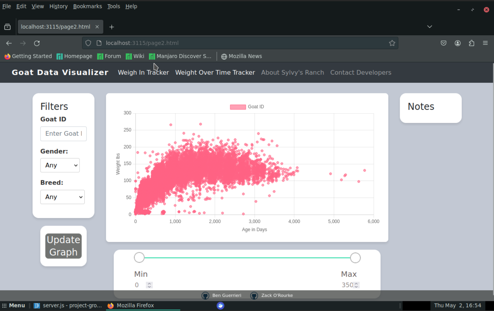

# Full Stack Goat Database Visualization Project

## Overview

This project aims to enhance sustainable goat farming at Silvies Valley Ranch by implementing a database system for organizing and visualizing goat growth trajectories based on different filters specified by the user. The application allows users to select groups of goats with different breeds, weights, genders, and birth dates to visualize their weigh in dates and view growth curves over time. It also supports inspecting specific goats and all of their weigh ins at all ages with dynamic graph updates. This solution aids in improving breeding programs and resource management, enabling data-driven decisions that help the sustainability and effectiveness of goat farming practices.

## Key Features

- **Advanced Filtering Options**: Ability to filter goat data based on weight, gender, breed, and age to refine search and analysis.
- **Individual Goat Profiles**: View detailed profiles for specific goats including their growth curves and note records.
- **Notes on Individual Goats**: Access and review notes related to the health and condition of specific goats directly within the application.
- **Visual Analytics for Growth Curves**: Interactive visualization of growth curves for the entire goat population or specific filtered groups.
- **Weight Monitoring Visualization**: Track and visualize weigh-in dates and associated weight changes for all goats or selected cohorts, enhancing monitoring and management.

## Getting Started

### Prerequisites

- You need to have PostgreSQL installed on your machine.
- Node.js is required to run the server.

### Building the Database

1. Start by cloning the repository to your local machine.
2. Open a terminal and change to the cloned repository's directory.
3. Initiate PostgreSQL and execute the following command to set up the database schema and load the data:
    ```bash
    psql \i DDL.sql
    ```
    This command utilizes the CSV files found in the `CSVs` directory to populate the database.

### Configuring the Database Connection

1. Open `FullStack/queries.js`.
2. Adjust the `connectionString` variable to correspond with the port on which your database server is running.

### Running the Web Application

1. Make sure you are inside the `FullStack` directory.
2. Launch the server with the command:
    ```bash
    node server.js
    ```
3. Ensure the port variables in `server.js` and other relevant files are correctly set to match your configuration.
4. Open a web browser and navigate to `http://localhost:<PORT>` to access the web application.

## Application Preview



## Schema

The schema consists of several tables:

1. **GOAT**:
   - The GOAT table represents individual goats within the database.
   - Attributes include Goat_id (unique identifier), Gender, Birth_date, and Breed.
   - GOAT serves as the primary entity for storing basic information about each goat in the system.

2. **WEIGH_IN**:
   - The WEIGH_IN table stores data related to weigh-ins of goats.
   - Attributes include Weigh_in_date, Weight, and Goat_id.
   - Each record represents a specific weigh-in event for a goat, allowing the tracking of weight changes over time.

3. **NOTE**:
   - The NOTE table contains notes recorded for individual goats.
   - Attributes include Goat_id, Date_of_note, and Note.
   - Notes provide additional information or observations about specific goats, aiding in their management and tracking.

4. **GOAT_ACTIVITY**:
   - The GOAT_ACTIVITY table records various activities of goats during sessions.
   - Attributes include Session_id, Goat_id, Activity_code, Activity_date, is_exported, and is_deleted.
   - This table facilitates the tracking of different activities carried out by goats during specific sessions, providing valuable insights into their behavior and performance.


## Contributors

- Zack O'Rourke
  - Email: zorourke14@gmail.com
  - April 2024
- Ben Guerrieri
  - Email: guerrib2@tcnj.edu
  - April 2024
    
## License

This project is licensed under the [MIT License](LICENSE).
